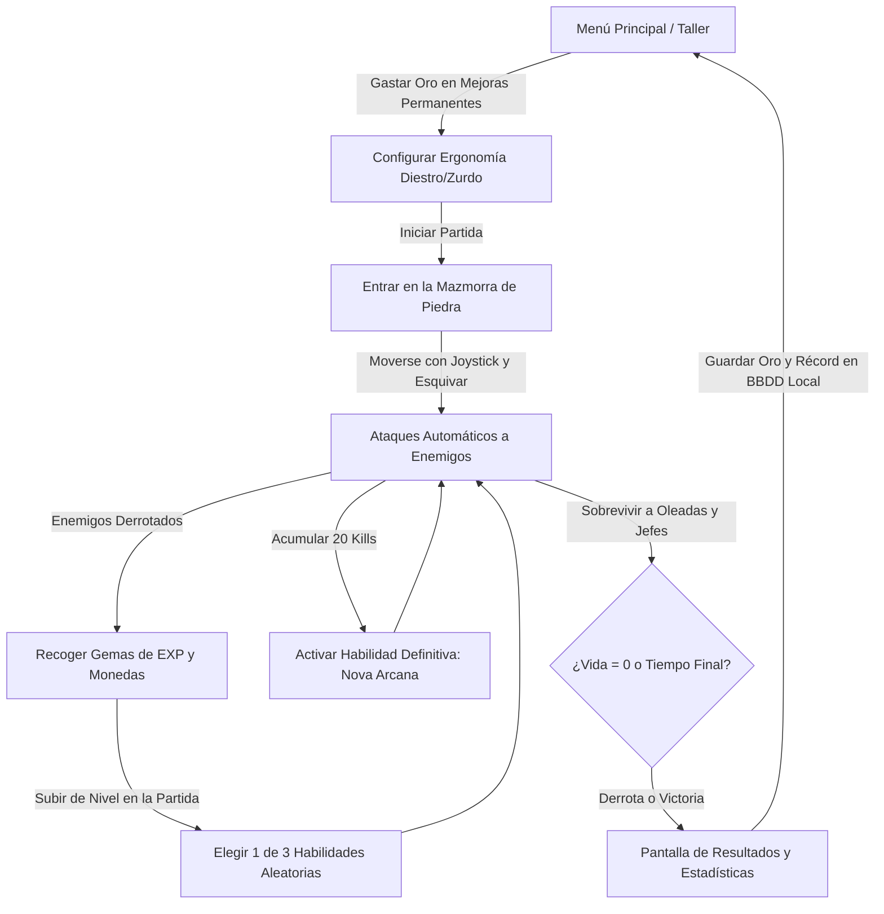

# DISEÑO Y ARQUITECTURA DEL JUEGO: *SHADOW VAULT*

Documento de Diseño del Juego (GDD) y especificación técnica de la arquitectura, mecánicas, base de datos local y sistema de guardado.

---

## 1. Concepto General del Juego

### 1.1. Género y Premisa
- **Título:** **Shadow Vault** (anteriormente *Dungeon Survivor*).
- **Género:** Roguelite de Acción y Supervivencia 2D (*Survivor / Dungeon Crawler*).
- **Estilo de Sesión:** Partidas rápidas y dinámicas de **3 a 10 minutos**, perfectamente adaptadas para dispositivos móviles.
- **Orientación:** Vertical (*Portrait*), permitiendo jugar cómodamente con una sola mano, o con opción de soporte horizontal (*Landscape*).
- **Control:** Palanca virtual dinámica con soporte ergonómico para **Modo Diestro** (joystick izquierda, definitiva derecha) y **Modo Zurdo** (joystick derecha, definitiva izquierda).
- **Estilo Visual:** Mazmorra de piedra oscura con sello ceremonial rúnico sangriento central, sprites temáticos, proyectiles mágicos brillantes y números de daño flotantes (*damage popups*).

---

## 2. Bucle de Juego (*Core Game Loop*)



### 2.1. Mecánicas en Partida (*In-Game Loop*)
1. **Movimiento:** El jugador mueve a su personaje mediante el joystick táctil virtual.
2. **Auto-Ataque:** El personaje dispara automáticamente al enemigo más cercano dentro de su rango (450 px) con cadencia y daño mejorables.
3. **Habilidad Definitiva (*Nova Arcana*):** Cada baja suma carga al botón de la definitiva; al llegar a 20 eliminaciones se activa un botón pulsante con onda de choque de 360 grados y repulsión.
4. **Oleadas Progresivas:** Cada 45 segundos aumenta el nivel de oleada.
   - *Oleadas 1-2:* Murciélagos, esqueletos y brutos iniciales.
   - *Oleada 3 en adelante:* Se incorporan Magos Cultistas (ataque a distancia) y Duendes Bomba (kamikazes con explosión de área).
   - *Oleada 5 y 10:* Aparición de Lord Malakor (Jefe con barra de salud en HUD y disparos en abanico).
5. **Subida de Nivel (*Level Up*):** Al llenar la barra de EXP, el juego se pausa y se presentan 3 cartas de habilidad aleatorias (*Furia Destructiva*, *Cadencia Arcana*, *Zancada Veloz*, *Bendición Vital*, *Vórtice Magnético*).

### 2.2. Meta-Progresión (*Out-of-Game Loop*)
- Todo el oro recogido en las partidas se almacena en la **base de datos local SQLite** del dispositivo.
- En el **Taller del Menú**, el jugador gasta este oro para desbloquear mejoras que aplican permanentemente a todas las futuras partidas:
  - Vitalidad Titánica (+10% de vida por nivel).
  - Fuerza Arcana (+8% de daño por nivel).
  - Pies Alados (+5% de velocidad de movimiento por nivel).
  - Magnetismo Áureo (+15% de radio de imán por nivel).

---

## 3. Arquitectura Técnica con Flutter y Flame Engine

El juego se estructura combinando lo mejor de dos mundos:
- **Flame Engine:** Renderizado acelerado por hardware a 60/120 FPS de sprites, colisiones, proyectiles y partículas dentro del `Canvas`.
- **Flutter Widgets (Overlays):** Interfaces limpias, reactivas y táctiles para el HUD, barra de vida, menús de selección de cartas, pausa y tienda.

```
┌─────────────────────────────────────────────────────────┐
│                      FLUTTER APP                        │
│                                                         │
│  ┌───────────────────────────────────────────────────┐  │
│  │            FLUTTER OVERLAYS (UI NATIVA)           │  │
│  │   - HUD: Barra de Vida, Nivel, Tiempo, Pausa      │  │
│  │   - Modales: Level-Up Cards (3 opciones)          │  │
│  │   - Tienda de Mejoras Permanentes (Taller)        │  │
│  └───────────────────────────────────────────────────┘  │
│                                                         │
│  ┌───────────────────────────────────────────────────┐  │
│  │             FLAME GAME ENGINE (CANVAS)            │  │
│  │   - Game Loop: update(dt) & render(canvas)        │  │
│  │   - CameraComponent: Seguimiento suave            │  │
│  │   - PlayerComponent & JoystickComponent           │  │
│  │   - EnemyManager & SpawnPool (Reutilización RAM)  │  │
│  │   - CollisionDetection & Hitboxes                 │  │
│  │   - ParticleSystem (Chispas, sangre, explosiones) │  │
│  └───────────────────────────────────────────────────┘  │
│                                                         │
│  ┌───────────────────────────────────────────────────┐  │
│  │       CAPA DE DATOS LOCAL (DRIFT / SQLITE)        │  │
│  │   - Repositorio de Perfil y Monedas               │  │
│  │   - Repositorio de Mejoras Permanentes            │  │
│  │   - Historial de Récords y Logros                 │  │
│  └───────────────────────────────────────────────────┘  │
└─────────────────────────────────────────────────────────┘
```

---

## 4. Base de Datos Local: Diseño y Esquema Relacional

Utilizaremos **Drift (SQLite)** compilado nativamente para Android (C++) e iOS (SQLite3 nativo). No requiere conexión a internet, no tiene costes de servidor y ofrece tiempos de lectura/escritura inferiores a **2 milisegundos**.

### 4.1. Esquema de Tablas (DDL en SQLite)

```sql
-- 1. Perfil del Jugador y Recursos Globales
CREATE TABLE player_profile (
    id INTEGER PRIMARY KEY AUTOINCREMENT,
    player_name TEXT NOT NULL DEFAULT 'Héroe',
    gold_coins INTEGER NOT NULL DEFAULT 0,
    gems INTEGER NOT NULL DEFAULT 0,
    total_kills INTEGER NOT NULL DEFAULT 0,
    total_runs INTEGER NOT NULL DEFAULT 0,
    total_time_played_seconds INTEGER NOT NULL DEFAULT 0,
    created_at DATETIME NOT NULL DEFAULT CURRENT_TIMESTAMP,
    last_login DATETIME NOT NULL DEFAULT CURRENT_TIMESTAMP
);

-- 2. Mejoras Permanentes (Meta-Progression)
CREATE TABLE permanent_upgrades (
    upgrade_id TEXT PRIMARY KEY,          -- ej: 'max_health', 'attack_speed', 'gold_gain'
    name TEXT NOT NULL,                   -- ej: 'Vitalidad Ancestral'
    description TEXT NOT NULL,
    current_level INTEGER NOT NULL DEFAULT 0,
    max_level INTEGER NOT NULL DEFAULT 10,
    base_cost INTEGER NOT NULL,          -- Coste inicial en oro
    cost_multiplier REAL NOT NULL DEFAULT 1.5, -- Aumento de coste por nivel
    bonus_per_level REAL NOT NULL         -- ej: +0.05 (+5%) por nivel
);

-- 3. Historial de Partidas y Récords
CREATE TABLE run_history (
    id INTEGER PRIMARY KEY AUTOINCREMENT,
    score INTEGER NOT NULL,
    survived_seconds INTEGER NOT NULL,
    enemies_slain INTEGER NOT NULL,
    gold_earned INTEGER NOT NULL,
    wave_reached INTEGER NOT NULL,
    played_at DATETIME NOT NULL DEFAULT CURRENT_TIMESTAMP
);

-- 4. Logros y Desafíos Locales
CREATE TABLE achievements (
    code TEXT PRIMARY KEY,                -- ej: 'kill_100_skeletons', 'survive_5_min'
    title TEXT NOT NULL,
    description TEXT NOT NULL,
    reward_gold INTEGER NOT NULL DEFAULT 100,
    current_progress INTEGER NOT NULL DEFAULT 0,
    target_progress INTEGER NOT NULL,
    is_completed BOOLEAN NOT NULL DEFAULT 0,
    unlocked_at DATETIME
);

-- 5. Configuración del Juego
CREATE TABLE game_settings (
    id INTEGER PRIMARY KEY CHECK (id = 1), -- Fila única
    music_volume REAL NOT NULL DEFAULT 0.7,
    sfx_volume REAL NOT NULL DEFAULT 0.9,
    haptics_enabled BOOLEAN NOT NULL DEFAULT 1,
    damage_numbers_enabled BOOLEAN NOT NULL DEFAULT 1,
    target_frame_rate INTEGER NOT NULL DEFAULT 60,
    language_code TEXT NOT NULL DEFAULT 'es',
    is_left_handed BOOLEAN NOT NULL DEFAULT 0,
    difficulty_mode TEXT NOT NULL DEFAULT 'nightmare'
);

-- 6. Guardado Temporal de Partida Activa (Resume State)
CREATE TABLE active_run_state (
    id INTEGER PRIMARY KEY CHECK (id = 1),
    is_active BOOLEAN NOT NULL DEFAULT 0,
    current_hp REAL NOT NULL,
    max_hp REAL NOT NULL,
    current_level INTEGER NOT NULL,
    current_exp REAL NOT NULL,
    survived_time REAL NOT NULL,
    gold_accumulated INTEGER NOT NULL,
    active_skills_json TEXT NOT NULL,     -- Serialización de cartas activas
    updated_at DATETIME NOT NULL DEFAULT CURRENT_TIMESTAMP
);
```

---

## 5. Estrategia de Guardado y Persistencia Segura

Para garantizar que el juego **nunca sufra micro-congelaciones (*frame drops*)** durante la acción a 60 FPS:

### 5.1. Regla de Oro: Memoria RAM vs Persistencia en Disco
1. **Durante la partida activa:**
   - La vida, la posición, las gemas recogidas y el oro ganado se actualizan **únicamente en variables de memoria RAM**.
   - **Cero operaciones de disco** en el método `update(double dt)` del bucle de juego.
2. **Al terminar la partida (Victoria o Derrota):**
   - Se ejecuta una transacción atómica asíncrona de Drift en un hilo de fondo:
     ```dart
     await database.transaction(() async {
       await database.playerProfileDao.addGold(goldEarned);
       await database.playerProfileDao.incrementKills(kills);
       await database.runHistoryDao.insertRun(runRecord);
       await database.activeRunDao.clearActiveRun();
     });
     ```
3. **Al salir de la aplicación o entrar una llamada (Pausa en segundo plano):**
   - El ciclo de vida de Flutter (`AppLifecycleState.paused`) captura el estado exacto de la partida y escribe en la tabla `active_run_state`.
   - Cuando el usuario reabre la app, puede pulsar *"Reanudar Partida"* o *"Abandonar"*.

### 5.2. Protección e Integridad Local
Para evitar que un usuario manipule fácilmente las monedas locales modificando el archivo `.db`:
- Se almacena una firma hash (SHA-256) del perfil:
  `Hash = SHA256(gold + total_runs + secret_salt)`.
- Al iniciar la app, si el hash almacenado no coincide con los valores calculados de las monedas, se restaura la última copia de seguridad local válida.

---

## 6. Sistema de Audio y Retroalimentación Háptica

1. **Música de Fondo (BGM):**
   - Pista ambiental en bucle de baja intensidad para el menú principal.
   - Pista dinámica y trepidante durante el combate.
   - Precargadas en memoria con `FlameAudio.bgm.initialize()`.
2. **Efectos de Sonido (SFX):**
   - `hit.wav`: Impacto a un enemigo.
   - `gem_pickup.wav`: Recolección de gema (sonido agudo y satisfactorio).
   - `level_up.wav`: Fanfarria breve al subir de nivel.
   - `player_hurt.wav`: Daño recibido.
   - `boss_warning.wav`: Alarma de aparición del jefe.
3. **Vibración Háptica (Haptic Feedback):**
   - Micro-vibración sutil (`HapticFeedback.lightImpact()`) al recoger gemas o golpear con un golpe crítico.
   - Vibración más intensa (`HapticFeedback.mediumImpact()`) al recibir daño.

---

## 7. Plan de Implementación Técnica de Clases

Las clases principales del sistema se dividen en:

| Archivo / Clase | Responsabilidad |
|---|---|
| `DungeonGame (extends FlameGame)` | Controla el bucle a 60 FPS, control de cámaras, spawning por oleadas y overlays. |
| `PlayerComponent` | Sprite del héroe, movimiento analógico con joystick, auto-disparo y habilidad definitiva Nova Arcana. |
| `EnemyComponent` | Tipos variados: Murciélago, Esqueleto, Bruto, Mago Cultista, Duende Bomba y Jefe Lord Malakor. |
| `EnemyBulletComponent` | Proyectil mágico disparado por enemigos (Cultista y Jefe) que daña al jugador al impactar. |
| `ExplosionComponent` | Onda expansiva ígnea provocada por la detonación del Duende Bomba al morir. |
| `DungeonMapComponent` | Renderizado ultra-rápido en GPU con PictureRecorder del suelo de piedra y el sello arcano sangriento. |
| `GemComponent` | Gemas de EXP y monedas de oro con física de atracción magnética acelerada hacia el jugador. |
| `AudioManager` | Gestión nativa de efectos sonoros mediante pools de audio reutilizables (`AudioPool`) de latencia cero. |
| `AppDatabase` | Base de datos SQLite relacional embebida (Drift) sin conexión a internet. |
| `HudOverlay` | Widget de Flutter con barras de salud, exp, cronómetro, barra superior de jefe y botón de la definitiva. |
| `WorkshopOverlay` | Taller de mejoras permanentes con persistencia SQLite y selector ergonómico Diestro/Zurdo. |
| `LevelUpOverlay` | Modal de subida de nivel con selección de 3 cartas de bendiciones aleatorias. |
